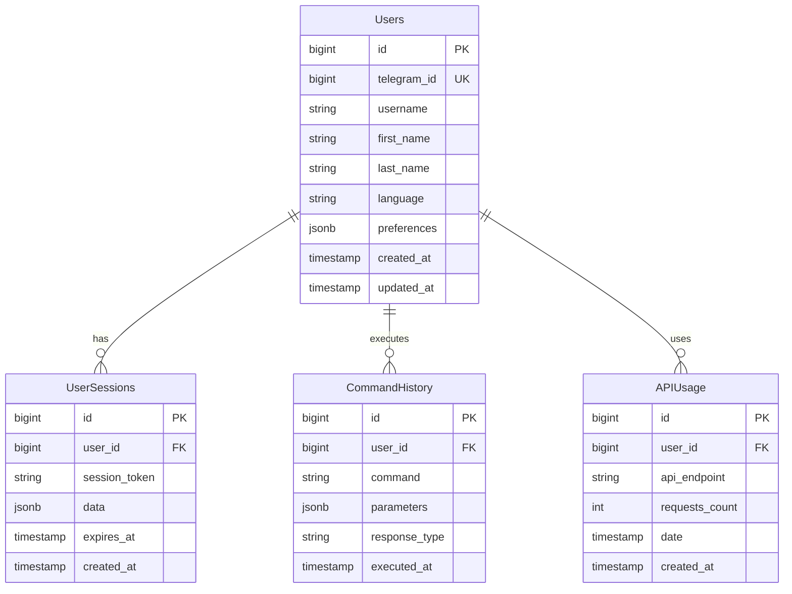

# 🏗 DevMate Bot Architecture Documentation

## 🎯 System Overview

DevMate Bot is a modern, scalable Telegram bot built with Go, designed to assist developers with daily tasks. The architecture follows clean architecture principles with clear separation of concerns, making it maintainable and testable.

## 🏛 Architectural Patterns

### 1. Layered Architecture
```
┌─────────────────────────────┐
│     Presentation Layer      │  ← HTTP Handlers, Webhook Endpoints
├─────────────────────────────┤
│      Application Layer      │  ← Business Logic, Command Handlers
├─────────────────────────────┤
│       Domain Layer          │  ← Entities, Value Objects
├─────────────────────────────┤
│    Infrastructure Layer     │  ← Database, External APIs, Config
└─────────────────────────────┘
```

### 2. Dependency Injection
```go
type Bot struct {
    config      *config.Config
    db          database.Repository
    telegram    telegram.Client
    github      github.Service
    ai          ai.Service
    logger      logger.Logger
}

func NewBot(deps Dependencies) *Bot {
    return &Bot{
        config:   deps.Config,
        db:       deps.Database,
        telegram: deps.TelegramClient,
        // ... other dependencies
    }
}
```

### 3. Repository Pattern
```go
type UserRepository interface {
    Create(ctx context.Context, user *User) error
    GetByTelegramID(ctx context.Context, telegramID int64) (*User, error)
    Update(ctx context.Context, user *User) error
    Delete(ctx context.Context, id int64) error
}

type PostgresUserRepository struct {
    db *sql.DB
}

func (r *PostgresUserRepository) Create(ctx context.Context, user *User) error {
    // Implementation
}
```

## 🗂 Directory Structure

```
devmate-bot/
├── cmd/
│   └── bot/
│       └── main.go                 # Application entry point
├── internal/                       # Private application code
│   ├── app/
│   │   ├── bot.go                 # Main bot application
│   │   └── dependencies.go        # Dependency injection setup
│   ├── handlers/                   # HTTP and message handlers
│   │   ├── webhook.go             # Telegram webhook handler
│   │   ├── health.go              # Health check handler
│   │   └── commands/              # Command handlers
│   │       ├── start.go
│   │       ├── help.go
│   │       └── code.go
│   ├── services/                   # Business logic services
│   │   ├── user/
│   │   │   ├── service.go
│   │   │   └── repository.go
│   │   ├── github/
│   │   │   ├── service.go
│   │   │   └── client.go
│   │   └── ai/
│   │       ├── service.go
│   │       └── openai.go
│   ├── domain/                     # Domain entities and logic
│   │   ├── user/
│   │   │   ├── user.go
│   │   │   └── errors.go
│   │   └── message/
│   │       ├── message.go
│   │       └── command.go
│   ├── infrastructure/             # External integrations
│   │   ├── database/
│   │   │   ├── postgres.go
│   │   │   ├── sqlite.go
│   │   │   └── migrations/
│   │   ├── telegram/
│   │   │   ├── client.go
│   │   │   └── types.go
│   │   ├── config/
│   │   │   ├── config.go
│   │   │   └── loader.go
│   │   └── logger/
│   │       ├── logger.go
│   │       └── structured.go
│   └── middleware/                 # Application middleware
│       ├── auth.go
│       ├── ratelimit.go
│       └── logging.go
├── api/                           # API definitions and docs
│   ├── openapi.yaml
│   └── telegram/
│       └── types.go
├── web/                           # Web interface (admin dashboard)
│   ├── dashboard/
│   │   ├── main.go
│   │   ├── handlers/
│   │   └── templates/
│   └── static/
│       ├── css/
│       ├── js/
│       └── images/
├── configs/                       # Configuration files
│   ├── bot.json
│   ├── messages/
│   │   ├── en.json
│   │   ├── uz.json
│   │   └── ru.json
│   └── environments/
│       ├── development.env
│       ├── staging.env
│       └── production.env
├── deployments/                   # Deployment configurations
│   ├── docker/
│   │   ├── Dockerfile
│   │   ├── docker-compose.yml
│   │   └── docker-compose.prod.yml
│   └── k8s/                      # Kubernetes manifests
│       ├── namespace.yaml
│       ├── deployment.yaml
│       ├── service.yaml
│       └── ingress.yaml
├── scripts/                      # Build and deployment scripts
│   ├── build.sh
│   ├── deploy.sh
│   ├── migrate.sh
│   └── test.sh
├── tests/                        # Test files
│   ├── unit/
│   │   ├── handlers/
│   │   ├── services/
│   │   └── domain/
│   ├── integration/
│   │   ├── api/
│   │   └── database/
│   └── e2e/
│       └── bot/
├── docs/                         # Documentation
│   ├── api/
│   ├── development/
│   └── deployment/
├── tools/                        # Development tools
│   ├── mockgen/
│   └── migrate/
├── go.mod                        # Go module definition
├── go.sum                        # Go module checksums
├── Makefile                      # Build automation
└── README.md                     # Project documentation
```

## 🔧 Component Architecture

### 1. Bot Application Layer
```go
// internal/app/bot.go
type Bot struct {
    config      *config.Config
    logger      logger.Logger
    db          database.Repository
    telegram    telegram.Client
    handlers    map[string]CommandHandler
    middleware  []Middleware
}

type CommandHandler interface {
    Handle(ctx context.Context, cmd *Command) (*Response, error)
    CanHandle(command string) bool
    Description() string
}

type Middleware interface {
    Process(ctx context.Context, next HandlerFunc) HandlerFunc
}
```

### 2. Message Processing Pipeline
```
Telegram → Webhook → Auth → Rate Limit → Router → Handler → Response
    ↓         ↓        ↓        ↓         ↓        ↓         ↓
  Update   Validate  User   Check     Route   Process   Format
           Message   Auth   Limits   Command  Business  Response
                                            Logic
```

### 3. Command Handler Architecture
```go
type CommandRouter struct {
    handlers map[string]CommandHandler
    fallback CommandHandler
}

func (r *CommandRouter) Route(ctx context.Context, command string) CommandHandler {
    if handler, exists := r.handlers[command]; exists {
        return handler
    }
    return r.fallback
}

// Example handler implementation
type StartCommandHandler struct {
    userService user.Service
    config      *config.Config
}

func (h *StartCommandHandler) Handle(ctx context.Context, cmd *Command) (*Response, error) {
    // Business logic implementation
    user, err := h.userService.GetOrCreate(ctx, cmd.User.TelegramID)
    if err != nil {
        return nil, err
    }
    
    message := h.config.GetMessage(user.Language, "commands.start.welcome", map[string]string{
        "name": cmd.User.FirstName,
    })
    
    return &Response{
        Text:      message,
        ParseMode: "HTML",
    }, nil
}
```

## 🗄 Database Architecture

### 1. Entity Relationship Diagram


### 2. Repository Pattern Implementation
```go
// Domain interface
type UserRepository interface {
    Create(ctx context.Context, user *User) error
    GetByTelegramID(ctx context.Context, telegramID int64) (*User, error)
    Update(ctx context.Context, user *User) error
    GetActiveUsers(ctx context.Context, limit int) ([]*User, error)
    GetUserStats(ctx context.Context) (*UserStats, error)
}

// Infrastructure implementation
type PostgresUserRepository struct {
    db     *sql.DB
    logger logger.Logger
}

func (r *PostgresUserRepository) Create(ctx context.Context, user *User) error {
    query := `
        INSERT INTO users (telegram_id, username, first_name, last_name, language)
        VALUES ($1, $2, $3, $4, $5)
        RETURNING id, created_at, updated_at
    `
    
    err := r.db.QueryRowContext(ctx, query,
        user.TelegramID,
        user.Username,
        user.FirstName,
        user.LastName,
        user.Language,
    ).Scan(&user.ID, &user.CreatedAt, &user.UpdatedAt)
    
    if err != nil {
        r.logger.Error("failed to create user", "error", err, "telegram_id", user.TelegramID)
        return fmt.Errorf("create user: %w", err)
    }
    
    return nil
}
```

## 🌐 External Integrations

### 1. Telegram API Client
```go
type TelegramClient interface {
    SendMessage(ctx context.Context, req *SendMessageRequest) (*Message, error)
    EditMessage(ctx context.Context, req *EditMessageRequest) (*Message, error)
    DeleteMessage(ctx context.Context, chatID int64, messageID int) error
    SetWebhook(ctx context.Context, webhookURL string) error
    GetUpdates(ctx context.Context, offset int) ([]*Update, error)
}

type HTTPTelegramClient struct {
    token      string
    baseURL    string
    httpClient *http.Client
    logger     logger.Logger
}

func (c *HTTPTelegramClient) SendMessage(ctx context.Context, req *SendMessageRequest) (*Message, error) {
    url := fmt.Sprintf("%s/bot%s/sendMessage", c.baseURL, c.token)
    
    jsonData, err := json.Marshal(req)
    if err != nil {
        return nil, fmt.Errorf("marshal request: %w", err)
    }
    
    httpReq, err := http.NewRequestWithContext(ctx, "POST", url, bytes.NewBuffer(jsonData))
    if err != nil {
        return nil, fmt.Errorf("create request: %w", err)
    }
    
    httpReq.Header.Set("Content-Type", "application/json")
    
    resp, err := c.httpClient.Do(httpReq)
    if err != nil {
        return nil, fmt.Errorf("send request: %w", err)
    }
    defer resp.Body.Close()
    
    if resp.StatusCode != http.StatusOK {
        return nil, fmt.Errorf("telegram API error: %d", resp.StatusCode)
    }
    
    var telegramResp TelegramResponse
    if err := json.NewDecoder(resp.Body).Decode(&telegramResp); err != nil {
        return nil, fmt.Errorf("decode response: %w", err)
    }
    
    return telegramResp.Result, nil
}
```

### 2. GitHub API Integration
```go
type GitHubService interface {
    GetRepository(ctx context.Context, owner, repo string) (*Repository, error)
    SearchRepositories(ctx context.Context, query string, limit int) ([]*Repository, error)
    GetUserProfile(ctx context.Context, username string) (*GitHubUser, error)
    GetRepositoryLanguages(ctx context.Context, owner, repo string) (map[string]int, error)
}

type HTTPGitHubService struct {
    token      string
    baseURL    string
    httpClient *http.Client
    logger     logger.Logger
}
```

### 3. AI Service Integration
```go
type AIService interface {
    ExplainCode(ctx context.Context, code, language string) (string, error)
    ReviewCode(ctx context.Context, code, language string) (*CodeReview, error)
    GenerateDocstring(ctx context.Context, function, language string) (string, error)
    AnswerQuestion(ctx context.Context, question string) (string, error)
}

type OpenAIService struct {
    apiKey     string
    baseURL    string
    httpClient *http.Client
    logger     logger.Logger
}
```

## 🔒 Security Architecture

### 1. Authentication & Authorization
```go
type AuthMiddleware struct {
    userRepo UserRepository
    logger   logger.Logger
}

func (m *AuthMiddleware) Process(ctx context.Context, next HandlerFunc) HandlerFunc {
    return func(ctx context.Context, update *Update) error {
        // Extract user from update
        telegramUser := update.Message.From
        
        // Get or create user in database
        user, err := m.userRepo.GetByTelegramID(ctx, int64(telegramUser.ID))
        if err != nil {
            if errors.Is(err, ErrUserNotFound) {
                user, err = m.createUser(ctx, telegramUser)
                if err != nil {
                    return fmt.Errorf("create user: %w", err)
                }
            } else {
                return fmt.Errorf("get user: %w", err)
            }
        }
        
        // Add user to context
        ctx = context.WithValue(ctx, UserContextKey, user)
        
        return next(ctx, update)
    }
}
```

### 2. Rate Limiting
```go
type RateLimitMiddleware struct {
    store  RateLimitStore
    limits map[string]RateLimit
    logger logger.Logger
}

type RateLimit struct {
    Requests int
    Period   time.Duration
}

func (m *RateLimitMiddleware) Process(ctx context.Context, next HandlerFunc) HandlerFunc {
    return func(ctx context.Context, update *Update) error {
        userID := update.Message.From.ID
        
        // Check rate limit
        if exceeded, err := m.store.IsRateLimited(ctx, userID, m.limits["default"]); err != nil {
            m.logger.Error("rate limit check failed", "error", err)
            return next(ctx, update) // Continue on error
        } else if exceeded {
            return &RateLimitError{RetryAfter: m.limits["default"].Period}
        }
        
        // Increment counter
        if err := m.store.Increment(ctx, userID); err != nil {
            m.logger.Error("rate limit increment failed", "error", err)
        }
        
        return next(ctx, update)
    }
}
```

## 📊 Monitoring & Observability

### 1. Structured Logging
```go
type StructuredLogger struct {
    logger *slog.Logger
}

func (l *StructuredLogger) Info(msg string, args ...interface{}) {
    l.logger.Info(msg, args...)
}

func (l *StructuredLogger) Error(msg string, args ...interface{}) {
    l.logger.Error(msg, args...)
}

func (l *StructuredLogger) With(args ...interface{}) Logger {
    return &StructuredLogger{
        logger: l.logger.With(args...),
    }
}
```

### 2. Metrics Collection
```go
type Metrics interface {
    IncrementCounter(name string, labels map[string]string)
    RecordHistogram(name string, value float64, labels map[string]string)
    SetGauge(name string, value float64, labels map[string]string)
}

type PrometheusMetrics struct {
    commandsTotal    *prometheus.CounterVec
    responseTime     *prometheus.HistogramVec
    activeUsers      prometheus.Gauge
    errorRate        *prometheus.CounterVec
}
```

### 3. Health Checks
```go
type HealthChecker struct {
    db       database.Health
    telegram telegram.Health
    github   github.Health
}

func (h *HealthChecker) Check(ctx context.Context) *HealthStatus {
    status := &HealthStatus{
        Status: "healthy",
        Checks: make(map[string]CheckResult),
    }
    
    // Database health
    if err := h.db.Ping(ctx); err != nil {
        status.Checks["database"] = CheckResult{
            Status: "unhealthy",
            Error:  err.Error(),
        }
        status.Status = "unhealthy"
    } else {
        status.Checks["database"] = CheckResult{Status: "healthy"}
    }
    
    // Add other health checks...
    
    return status
}
```

## 🚀 Deployment Architecture

### 1. Container Strategy
```dockerfile
# Multi-stage build for optimized image size
FROM golang:1.21-alpine AS builder

WORKDIR /app
COPY go.mod go.sum ./
RUN go mod download

COPY . .
RUN CGO_ENABLED=0 GOOS=linux go build -a -installsuffix cgo -o main cmd/bot/main.go

FROM alpine:latest
RUN apk --no-cache add ca-certificates tzdata
WORKDIR /root/

COPY --from=builder /app/main .
COPY --from=builder /app/configs ./configs

EXPOSE 8080
CMD ["./main"]
```

### 2. Kubernetes Deployment
```yaml
apiVersion: apps/v1
kind: Deployment
metadata:
  name: devmate-bot
spec:
  replicas: 3
  selector:
    matchLabels:
      app: devmate-bot
  template:
    metadata:
      labels:
        app: devmate-bot
    spec:
      containers:
      - name: bot
        image: devmate-bot:latest
        ports:
        - containerPort: 8080
        env:
        - name: BOT_TOKEN
          valueFrom:
            secretKeyRef:
              name: bot-secrets
              key: telegram-token
        resources:
          requests:
            memory: "64Mi"
            cpu: "250m"
          limits:
            memory: "128Mi"
            cpu: "500m"
        livenessProbe:
          httpGet:
            path: /health
            port: 8080
          initialDelaySeconds: 30
          periodSeconds: 10
        readinessProbe:
          httpGet:
            path: /ready
            port: 8080
          initialDelaySeconds: 5
          periodSeconds: 5
```

## 🔄 CI/CD Pipeline

### 1. GitHub Actions Workflow
```yaml
name: CI/CD Pipeline

on:
  push:
    branches: [main, develop]
  pull_request:
    branches: [main]

jobs:
  test:
    runs-on: ubuntu-latest
    steps:
    - uses: actions/checkout@v3
    - uses: actions/setup-go@v3
      with:
        go-version: 1.21
    
    - name: Run tests
      run: |
        go test -v -cover ./...
        go test -v -race ./...
    
    - name: Run linter
      uses: golangci/golangci-lint-action@v3
      with:
        version: latest

  build:
    needs: test
    runs-on: ubuntu-latest
    steps:
    - uses: actions/checkout@v3
    
    - name: Build Docker image
      run: docker build -t devmate-bot:${{ github.sha }} .
    
    - name: Push to registry
      if: github.ref == 'refs/heads/main'
      run: |
        echo ${{ secrets.DOCKER_PASSWORD }} | docker login -u ${{ secrets.DOCKER_USERNAME }} --password-stdin
        docker push devmate-bot:${{ github.sha }}

  deploy:
    needs: build
    runs-on: ubuntu-latest
    if: github.ref == 'refs/heads/main'
    steps:
    - name: Deploy to production
      run: |
        # Deployment scripts
        kubectl set image deployment/devmate-bot bot=devmate-bot:${{ github.sha }}
```

This architecture documentation provides a comprehensive overview of the system design, making it easy for new developers to understand the codebase and for Claude Code to generate appropriate code following the established patterns.